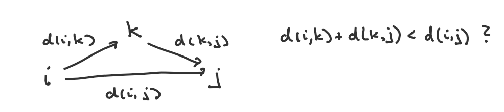

## Algo Muster

### Infinity

Python
```Python
inf = float('inf')
inf = 1<<59   # = 2 hoch 59 = eine sehr große Zahl - ist schneller als float('inf')
```

C++
```Cpp
const int inf = 1e9;
const long long inf = 1e18;
```

### Adjazenzliste erstellen.

n = Anzahl der Knoten, m = Anzahl der Kanten

Python
```Python
n, m = [int(x) for x  in input().split()]      
adj = [[] for i in range(n+1)]
for i in range(m):
    a, b, c = [int(x) for x in input().split()]
    adj[a].append([b,c])
```

C++
```Cpp
int n, m;
cin >> n >> m;
vector<pair<int, int>> adj[n + 1];
for (int i = 0; i < m; i++) {
    int a, b, c;
    cin >> a >> b >> c;
    adj[a].push_back({b, c});
}
```

### Adjazenzmatrix erstellen.

n = Anzahl der Knoten, m = Anzahl der Kanten

Python
```Python
inf = float('inf')
zeile = [inf for _ in range(n)]
adj = [zeile[:] for _ in range(n)]
for i in range(n): adj[i][i] = 0
for i in range(m):
    a, b, c = [int(x) for x in input().split()]
    a-=1
    b-=1
    adj[a][b] = adj[b][a]= c
```

C++
```Cpp
long long adj[n][n];
for (int i = 0; i < n; i++) {
    for (int j = 0; j < n; j++) {
        if (i == j)
            adj[i][j] = 0;
        else
            adj[i][j] = inf;
    }
}

for (int i = 0; i < m; i++) {
    int a, b, c;
    cin >> a >> b >> c;
    a--;
    b--;
    adj[a][b] = c;
    adj[b][a] = c;
}
```

### Anzahl Zusammenhangskomponenten (im ungerichteten Graphen)

Wir starten von jedem nicht besuchten Knoten ein dfs und zählen, wie oft wir starten müssen um alle Knoten zu besuchen. Das CSES-Problem *counting rooms* ist ein Beispiel dafür, dass Python nur mit der nicht-rekursiven Implementation von dfs das Zeitlimit schafft.

Python

```Python
n, m = [int(x) for x in input().split()]
h = [1,-1,0,0]
v = [0,0,1,-1]
vis = [[False]*m for _ in range(n)]

def dfs(x, y):
    vis[x][y] = True
    stack = [(x, y)]
    while stack:
        x, y = stack.pop()
        for i in range(4):
            dx = x + h[i]
            dy = y + v[i]
            if 0 <= dx < n and 0 <= dy < m and not vis[dx][dy]:
                vis[dx][dy] = True
                stack.append((dx, dy))

for i in range(n):
    row = input()
    for j in range(m):
        if row[j] == '#':
            vis[i][j] = True
            
ans = 0
for i in range(n):
    for j in range(m):
        if not vis[i][j]:
            ans += 1
            dfs(i, j)
print(ans)
```

C++
```Cpp
#include <bits/stdc++.h>

using namespace std;

int n, m;
int h[] = {1, -1, 0, 0}, v[] = {0, 0, 1, -1};
bool vis[1000][1000];

void dfs(int x, int y) {
    vis[x][y] = true;
    stack<pair<int, int>> st;
    st.push({x, y});
    while (!st.empty()) {
        auto [x, y] = st.top();
        st.pop();
        for (int i = 0; i < 4; i++) {
            int dx = x + h[i], dy = y + v[i];
            if (0 <= dx && dx < n && 0 <= dy && dy < m && !vis[dx][dy]) {
                vis[dx][dy] = true;
                st.push({dx, dy});
            }
        }
    }
}

int main() {
    int ans = 0;
    char c;
    cin >> n >> m;
    for (int i = 0; i < n; i++) {
        for (int j = 0; j < m; j++) {
            cin >> c;
            vis[i][j] = (c == '#');
        }
    }
    for (int i = 0; i < n; i++) {
        for (int j = 0; j < m; j++) {
            if (!vis[i][j]) {
                dfs(i, j);
                ans++;
            }
        }
    }
    cout << ans << endl;
}
```

In C++ ist auch die rekursive Version schnell genug
```Cpp
void dfs(int x, int y) {
    vis[x][y] = true;
    for (int i = 0; i < 4; i++) {
        int dx = x + h[i], dy = y + v[i];
        if (0 <= dx && dx < n && 0 <= dy && dy < m && !vis[dx][dy])
            dfs(dx, dy);
    }
}

```

[CSES: Counting Rooms](https://cses.fi/problemset/task/1192/)

----


### Floyd-Warshall

Kürzeste Wege zwischen allen Knoten.

Für n Knoten initialisiere n x n Adjazenzmatrix D mit den Kosten der gegebenen Wege, 0 in 
der Diagonalen und INF sonst. Bei Zeitproblemen initialisiere die Matrix eindimensional.

C++
```Cpp
for (int k = 0; k < n; k++) {
    for (int i = 0; i < n; i++) {
        for (int j = 0; j < n; j++) {
            adj[i][j] = min(adj[i][j], adj[i][k] + adj[k][j]);
        }
    }
}
```




[CSES: Shortest Path2](https://cses.fi/problemset/task/1672)

### Dijkstra

Kürzeste Wege zwischen einem Knoten und allen anderen.

```
Lies die Entfernungsdaten in eine Adjazenzliste adj ein.
Setze dist des Startknotens s auf 0, alle anderen auf unendlich. 
Initialisiere einen Heap q und füge den Startknoten mit Distanz 0 hinzu.
Initialisiere ein visited-Array oder set.
Solange q nicht leer:
    hole das erste Element v und markiere es als visited
    Für jeden Nachbarn v von u:  
        falls dist[v] besser wird, füge v mit dist[v] in den Heap Q ein.
```

Python
```Python
from heapq import heappop, heappush

dist = [inf for _ in range(n+1)]
dist[1] = 0
vis = set()    

q = [(0,1)]
while q:
    _, u = heappop(q)
    if u in vis: continue
    vis.add(u)
    for v,c in adj[u]:
        if dist[v] > dist[u] + c:
            dist[v] = dist[u] + c
            heappush(q,(dist[v],v))
```

Wir gehen davon aus, dass die Distanzen in den *long long*-Bereich fallen können, dass
aber die Entfernungen von Nachbarn und die Anzahl der Knoten im *int*-Bereich bleiben.

C++
```Cpp

long long dist[n + 1];
int vis[n + 1];

for (int i = 1; i < n + 1; i++) {
    dist[i] = INF;
    vis[i] = 0;
}
dist[1] = 0;

priority_queue<pair<long long, int>> q;
q.push({0, 1});

while (!q.empty()) {
    auto [d, u] = q.top();
    q.pop();
    if (vis[u] == 1) continue;
    vis[u] = 1;
    for (auto [v, c] : adj[u]) {
        if (dist[v] > dist[u] + c) {
            dist[v] = dist[u] + c;
            q.push({-dist[v], v});
        }
    }
}

```

[CSES: Shortest Path1](https://cses.fi/problemset/task/1671)

### Längster Pfad zwischen zwei Knoten in einem DAG.

Wir berechnen die maximale Anzahl von Knoten zwischen einem beliebigen Knoten und dem Zielknoten. Wir initialisieren diese Werte mit 0, für den Zielknoten mit 1. Dann gehen wir mit dfs rekursiv durch den Graphen. Die Werte der Nachbarn nutzen wir, um für den aktuellen Knoten den längsten Pfad zu finden.

Python
```Python
sys.setrecursionlimit(100001)

adj = [[] for _ in range(100001)]
vis = [False]*100001
dp = [0]*100001
next_node = [0]*100001

def dfs(u):
    vis[u] = True
    for v in adj[u]:
        if not vis[v]:
            dfs(v)
        if dp[v]!= 0 and dp[v] + 1 > dp[u]:
            dp[u] = dp[v] + 1
            next_node[u] = v


```


C++
```Cpp
bool vis[100001];
vector<int> adj[100001];
int dp[100001];
int next_node[100001];

void dfs(int u) {
    vis[u] = true;
    for (int v : adj[u]) {
        if (!vis[v]) dfs(v);
        if ((dp[v] != -1) && (dp[v] + 1 > dp[u])) {
            dp[u] = dp[v] + 1;
            next_node[u] = v;
        }
    }
```

[CSES: Longest Flight Route](https://cses.fi/problemset/task/1680/)

### Bellman-Ford

Bellman-Ford löst das SSSP-Problem (Single Source Shortest Path) auch für Graphen mit negativen Gewichten, falls es dort keine negativen Zyklen gibt. Der Algorithmus findet auch heraus, ob es negative Zyklen gibt.
Den längsten Pfad erhält durch Betrachtung eines Graphen mit den Gewichten*(-1).

```
Setze dist des Startknotens auf 0, alle anderen auf unendlich (n = Anzahl der Knoten).
wiederhole n-1 mal:
    Für alle Kanten (u,v):
        Relaxiere(u,v)  

# Wenn es keinen negativen Zyklen gibt, ist jetzt kein Relaxieren mehr möglich.
wiederhole n-1 mal:
    Für alle Kanten (u,v):
        falls Relaxieren von (u,v) möglich: setze dist von v auf -inf 

dist[n] ist das Ergebnis, -inf falls negativer Zyklus auf dem Weg.
```

Python
```Python
for i in range(n-1):
    for u in range(1, n+1):
        for v,c in adj[u]:
            if dist[u] + c < dist[v]:
                dist[v] = dist[u] + c

for i in range(n-1):
    for u in range(1, n+1):
        for v,c in adj[u]:
            if dist[u] + c < dist[v]:
                dist[v] = -inf
```

C++
```Cpp
for (int i = 1; i < n + 1; i++) dist[i] = INF;
dist[1] = 0;

for (int i = 0; i < n - 1; i++) {
    for (int u = 1; u < n + 1; u++) {
        for (auto [v, c] : adj[u]) {
            if (dist[u] == INF) continue;  // wg. INF-20 < INF
            if (dist[u] + c < dist[v]) {
                dist[v] = dist[u] + c;
            }
        }
    }
}

for (int i = 0; i < n - 1; i++) {
    for (int u = 1; u < n + 1; u++) {
        for (auto [v, c] : adj[u]) {
            if (dist[u] == INF) continue;  // wg. INF-20 < INF
            if (dist[u] + c < dist[v]) {
                dist[v] = -INF;
            }
        }
    }
}

```

### Bellman-Ford  

[CSES: Cycle Finding](https://cses.fi/problemset/task/1197/)

Falls der Graph einen negativen Kreis enthält, soll der ausgegeben werden (bei mehreren reicht einer).

Wir gehen (n-1) mal durch alle Kanten und relaxieren, falls möglich (Bellman-Ford).
Dann gehen wir ein weitere Mal durch alle Kanten. Wir merken uns den Knoten, über den ein weiteres Relaxieren
möglich ist. Dieser Knoten muss nicht auf dem negativen Kreis liegen, aber wenn wir von dort genügend oft (n-1)  zurückgehen, sind wir sicher auf einem Knoten vc im negativen Kreis. Von vc gehen wir so oft zurück, bis wir vc wieder finden.

Da es uns nicht darauf ankommt, Entfernungen zu bestimmen, initialisieren wir das dist-Array mit 0 statt
mit unendlich (Wir wollen nur feststellen, ob nach (n-1) Iterationen Werte weiter ins Minus abrutschen).

In der Python-Version lesen wir alle Kantendaten in eine Liste ein und bewegen uns dann in 3er Schritten
von Kante zu Kante.

Python
```Python
import sys
n, m = map(int, sys.stdin.readline().split())
data = list(map(int, sys.stdin.read().split()))
 
dist = [0] * (n + 1)
prev= [-1] * (n + 1)

def findcycle(v):
    for _ in range(n-1):
        v = prev[v]
    cycle = [v]
    u = prev[v]
    while u != v:
        cycle.append(u)
        u = prev[u]
    cycle.append(v) 
    cycle.reverse()
    return cycle
 
def go():
    for _ in range(n - 1):
        for j in range(0, len(data), 3):
            u, v, c = data[j], data[j + 1], data[j + 2]
            if dist[u] + c < dist[v]:
                prev[v] = u
                dist[v] = dist[u] + c
 
    for j in range(0, len(data), 3):
        u, v, c = data[j], data[j + 1], data[j + 2]
        if dist[u] + c < dist[v]:
            print('YES')
            print(*findcycle(u))
            exit()
    print('NO')
 
go()

```

C++
```Cpp
vector<pair<int, int>> adj[2501];
int pre[2501];
long long dist[2501];

int main() {
    int n, m;
    cin >> n >> m;
    for (int i = 0; i < n + 1; i++) {
        pre[i] = -1;
    }
    for (int i = 0; i < m; i++) {
        int u, v, c;
        cin >> u >> v >> c;
        adj[u].push_back({v, c});
    }

    for (int i = 0; i < n - 1; i++) {
        for (int u = 1; u < n + 1; u++) {
            for (auto [v, c] : adj[u]) {
                if (dist[u] + c < dist[v]) {
                    dist[v] = dist[u] + c;
                    pre[v] = u;
                }
            }
        }
    }

    int vc = -1;
    for (int u = 1; u < n + 1; u++) {
        for (auto [v, c] : adj[u]) {
            if (dist[u] + c < dist[v]) {
                vc = u;
                break;
            }
        }
    }

    if (vc == -1) {
        cout << "NO" << endl;
        return 0;
    } else {
        cout << "YES" << endl;
    }

    for (int i = 1; i < n + 1; i++) {
        vc = pre[vc];
    }

    vector<int> cycle;
    cycle.push_back(vc);

    for (int v = pre[vc];; v = pre[v]) {
        cycle.push_back(v);
        if (v == vc)
            break;
    }

    reverse(cycle.begin(), cycle.end());
    for (auto v : cycle) {
        cout << v << " ";
    }
}
```

 


[CSES: Highscore](https://cses.fi/problemset/task/1673)