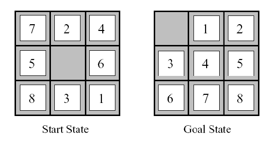
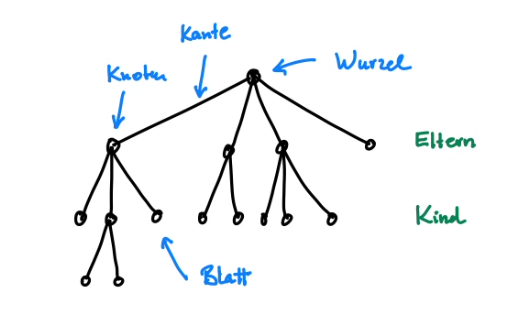
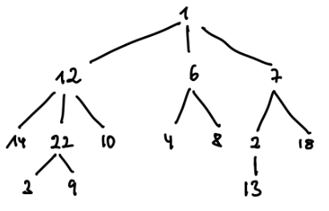

## Suchalgorithmen 1

In vielen Problemstellung geht es darum, in einer (meist sehr großen) Menge von Möglichkeiten
eine Lösung zu finden. Am Beispiel des 8-Puzzle werden verschiedene Suchalgorithmen
für das Finden einer Lösung vorgestellt.



Einzelne Spielstellungen stellen wir uns als Knoten vor. Die Kanten zwischen den Knoten sind mögliche Spielzüge.
Die Startstellung ist die Wurzel eines Suchbaums, in dem wir einen Pfad zu einem Knoten suchen, der den **goaltest** besteht.

### Bäume

Begriffe im Zusammenhang mit Bäumen



Ein einfacher Beispielbaum mit Zahlen als Knoten:



```
baum = {1:[12,6,7], 12: [14,22,10], 6: [4,8], 7: [2,18], 22:[3,9], 2:[13]}
```

### Breitensuche und Tiefensuche

Eine Baum _traversieren_ heißt, nacheinander alle seine Knoten zu besuchen.

Die Reihenfolge bei der _Breitensuche_:

```
1 12 6 7 14 22 10 4 8 2 18 3 9 13
```

Die Reihenfolge bei der _Tiefensuche_:

```
1 12 14 22 3 9 10 6 4 8 7 2 13 18
```

Zunächst _expandieren_ wir die Wurzel. _Expandieren_ bedeutet:
Wir schauen, ob dies der Zielknoten ist. Wenn der Knoten, den wir expandiert haben, der Zielknoten ist, sind wir fertig.
Wenn das nicht der Fall ist, fügen wir alle seine Kinder in die _frontier_ ein. Die _frontier_ sind die Knoten, die noch zur Untersuchung anstehen. Wir fügen den Knoten nur dann in die _frontier_ ein, wenn er nicht schon früher untersucht wurde oder bereits in der _frontier_ vorhanden ist. Dazu nutzen wir das dictionary _prev_, in dem wir alle Knoten, die jemals aus der _frontier_ geholt worden sind, mit ihrem Elternknoten abspeichern. Das machen wir solange, bis die _frontier_ leer ist.
Mit den Informationen in _prev_ verfolgen wir vom Zielknoten den Pfad zurück zur Wurzel.

Bei der Breitensuche ist die _frontier_ eine _Schlange_ (_queue_), bei der Tiefensuch ein _Keller_ (_stack_).
