### Drehfreudig


```
Beispiel 01:
Der Baum ist drehfreudig.
Alle Blätter haben die Tiefe 4.
Die Folge der Blätterbreiten ist ein Palindrom.
0.05555555555555555
0.05555555555555555
0.05555555555555555
0.05555555555555555
0.05555555555555555
0.05555555555555555
0.08333333333333333
0.08333333333333333
0.08333333333333333
0.08333333333333333
0.05555555555555555
0.05555555555555555
0.05555555555555555
0.05555555555555555
0.05555555555555555
0.05555555555555555
```


---

```
Beispiel 02:
Der Baum ist nicht drehfreudig.
Die Folge der Blätterbreiten ist kein Palindrom.
0.25
0.25
0.16666666666666666
0.16666666666666666
0.16666666666666666
```

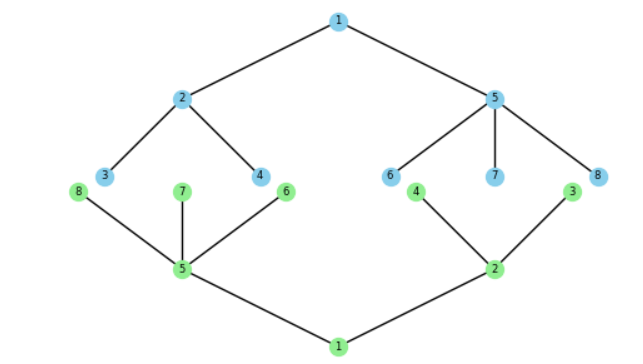

----

```
Beispiel 03:
Der Baum ist nicht drehfreudig.
Die Blätter haben nicht alle die gleiche Tiefe:
[3, 3, 4, 4, 3]
```

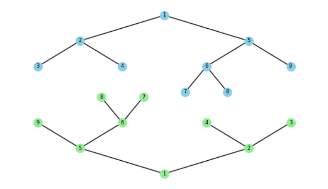

----


```
Beispiel 04:
Der Baum ist drehfreudig.
Alle Blätter haben die Tiefe 3.
Die Folge der Blätterbreiten ist ein Palindrom.
0.16666666666666666
0.16666666666666666
0.16666666666666666
0.16666666666666666
0.16666666666666666
0.16666666666666666
```

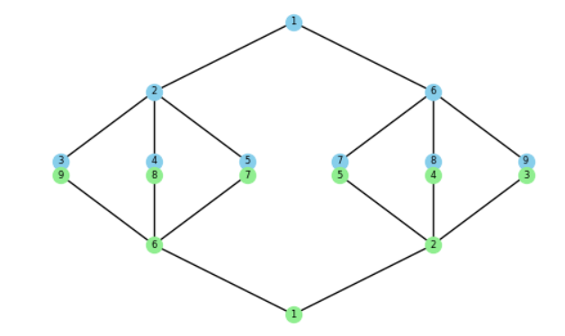

----

```
Beispiel 05:
Der Baum ist nicht drehfreudig.
Die Folge der Blätterbreiten ist kein Palindrom.
0.1111111111111111
0.1111111111111111
0.1111111111111111
0.16666666666666666
0.16666666666666666
0.08333333333333333
0.08333333333333333
0.08333333333333333
0.08333333333333333
```

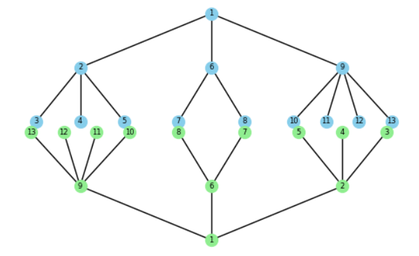

----

```
Beispiel 06:
Der Baum ist nicht drehfreudig.
Die Blätter haben nicht alle die gleiche Tiefe:
[3, 3, 3, 3, 3, 3, 4, 4, 4, 4, 4, 4]
```

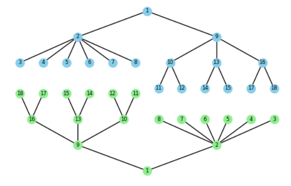

----

```
Beispiel 07:
Der Baum ist nicht drehfreudig.
Die Blätter haben nicht alle die gleiche Tiefe:
[3, 4, 6, 6, 5, 6, 6, 5, 4]
```

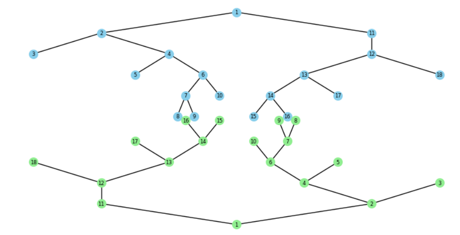

----

```
Beispiel 08:
Der Baum ist nicht drehfreudig.
Die Blätter haben nicht alle die gleiche Tiefe:
[3, 3, 3, 3, 3, 3, 3, 4, 4, 4, 4, 4, 4, 4, 4, 4, 4, 4, 3, 3, 3]
```

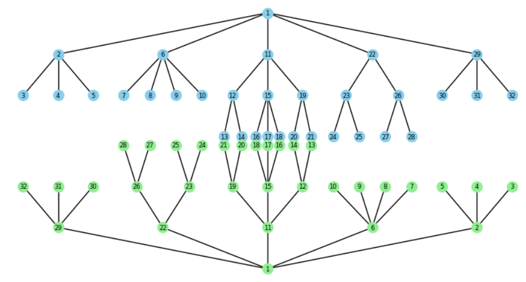

----

```
Beispiel 09:
Der Baum ist nicht drehfreudig.
Die Folge der Blätterbreiten ist kein Palindrom.
0.05555555555555555
0.05555555555555555
0.05555555555555555
0.05555555555555555
0.05555555555555555
0.05555555555555555
0.037037037037037035
0.037037037037037035
0.037037037037037035
0.05555555555555555
0.05555555555555555
0.05555555555555555
0.05555555555555555
0.05555555555555555
0.05555555555555555
0.05555555555555555
0.05555555555555555
0.05555555555555555
0.05555555555555555
```

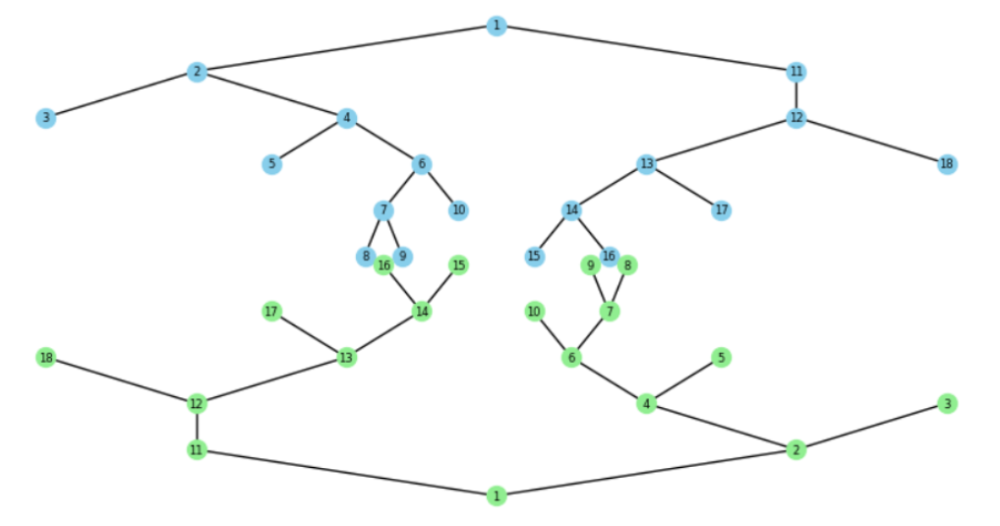

----

```
Beispiel 10:
Der Baum ist drehfreudig.
Alle Blätter haben die Tiefe 4.
Die Folge der Blätterbreiten ist ein Palindrom.
0.027777777777777776
0.027777777777777776
0.027777777777777776
0.027777777777777776
0.027777777777777776
0.027777777777777776
0.027777777777777776
0.027777777777777776
0.027777777777777776
0.027777777777777776
0.027777777777777776
0.027777777777777776
0.016666666666666666
0.016666666666666666
0.016666666666666666
0.016666666666666666
0.03333333333333333
0.03333333333333333
0.022222222222222223
0.022222222222222223
0.022222222222222223
0.03333333333333333
0.03333333333333333
0.016666666666666666
0.016666666666666666
0.016666666666666666
0.016666666666666666
0.027777777777777776
0.027777777777777776
0.027777777777777776
0.027777777777777776
0.027777777777777776
0.027777777777777776
0.027777777777777776
0.027777777777777776
0.027777777777777776
0.027777777777777776
0.027777777777777776
0.027777777777777776
```

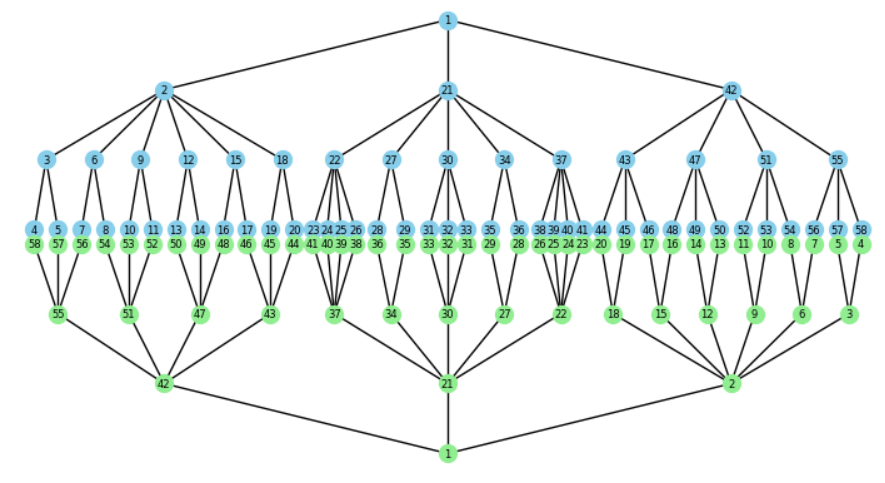

----

```
Beispiel 11:
Der Baum ist nicht drehfreudig.
Die Blätter haben nicht alle die gleiche Tiefe:
[6, 6, 5, 5, 5, 5, 5, 5, 5, 5, 5, 5, 5]
```

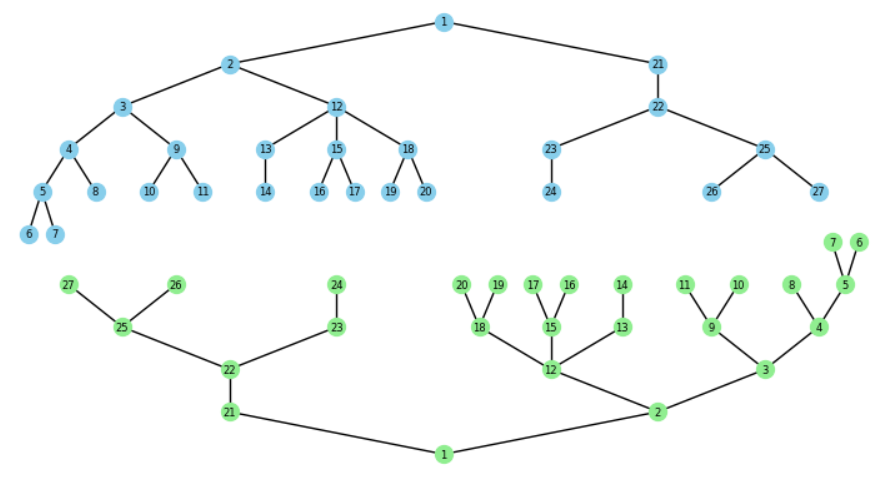

----

```
Beispiel 12:
Der Baum ist nicht drehfreudig.
Die Folge der Blätterbreiten ist kein Palindrom.
0.027777777777777776
0.027777777777777776
0.027777777777777776
0.027777777777777776
0.027777777777777776
0.027777777777777776
0.027777777777777776
0.027777777777777776
0.018518518518518517
0.018518518518518517
0.018518518518518517
0.027777777777777776
0.027777777777777776
0.03333333333333333
0.03333333333333333
0.022222222222222223
0.022222222222222223
0.022222222222222223
0.016666666666666666
0.016666666666666666
0.016666666666666666
0.016666666666666666
0.022222222222222223
0.022222222222222223
0.022222222222222223
0.03333333333333333
0.03333333333333333
0.041666666666666664
0.041666666666666664
0.027777777777777776
0.027777777777777776
0.027777777777777776
0.027777777777777776
0.027777777777777776
0.027777777777777776
0.027777777777777776
0.027777777777777776
0.027777777777777776
```

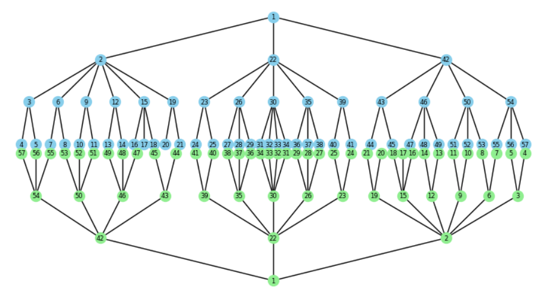

----

```
Beispiel 13:
Der Baum ist nicht drehfreudig.
Die Blätter haben nicht alle die gleiche Tiefe:
[5, 5, 5, 5, 5, 5, 5, 5, 5, 5, 5, 5, 5, 5, 5, 5, 5, 5, 5, 5, 5, 5, 5, 5, 5, 5, 5, 5, 5, 5, 5, 5, 5, 5, 5, 5, 4, 4, 4, 4, 4, 4, 4, 4, 4, 4, 4, 4, 4, 4, 4, 4, 4, 4, 4, 4, 4, 4, 4, 4, 4, 4, 4, 4, 4, 4, 4, 4, 4, 4, 4, 4]
```


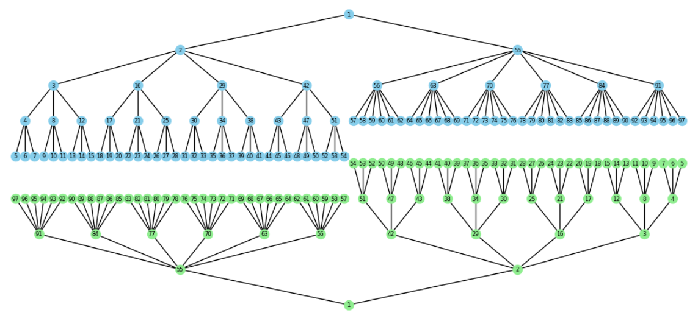

----

```
Beispiel 14:
Der Baum ist nicht drehfreudig.
Die Blätter haben nicht alle die gleiche Tiefe:
[4, 4, 4, 4, 4, 4, 4, 4, 4, 4, 4, 4, 4, 4, 4, 4, 4, 4, 4, 4, 4, 4, 4, 4, 3]
```

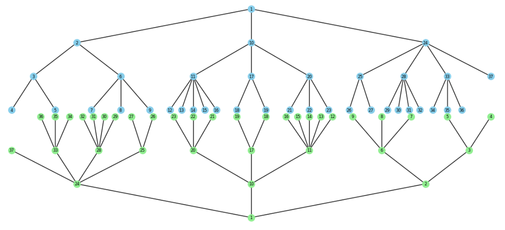

----

```
Beispiel 15:
Der Baum ist nicht drehfreudig.
Die Blätter haben nicht alle die gleiche Tiefe:
[3, 3, 3, 4, 4, 4, 4, 3, 3, 3, 3, 3, 3, 3]
```

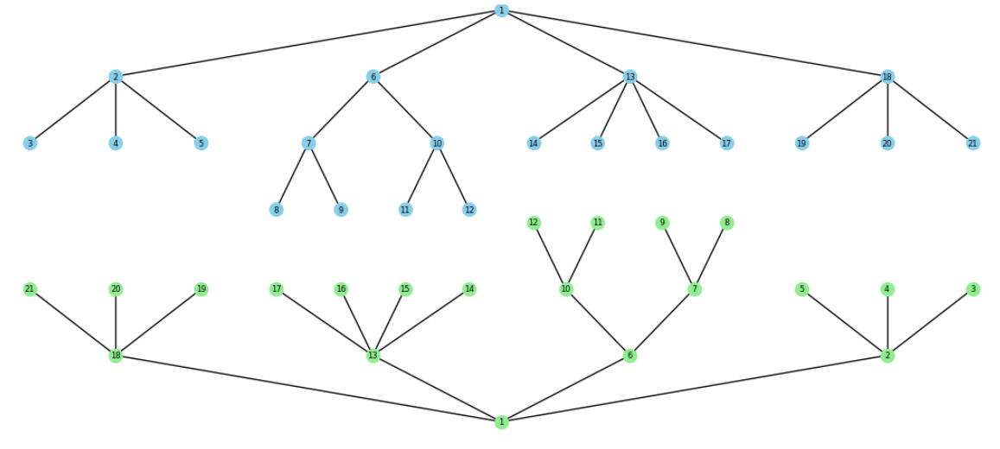


