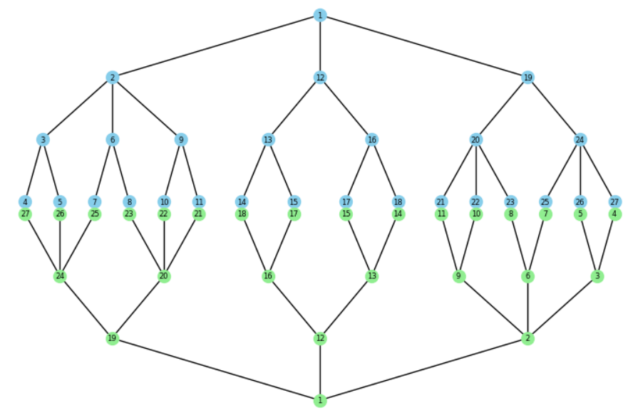

### Drehfreudig


```
Beispiel 01:
Der Baum ist drehfreudig.
Alle Blätter haben die Tiefe 4.
Die Folge der Blätterbreiten ist ein Palindrom.
0.05555555555555555
0.05555555555555555
0.05555555555555555
0.05555555555555555
0.05555555555555555
0.05555555555555555
0.08333333333333333
0.08333333333333333
0.08333333333333333
0.08333333333333333
0.05555555555555555
0.05555555555555555
0.05555555555555555
0.05555555555555555
0.05555555555555555
0.05555555555555555
```


---

```
Beispieldaten 02:
Der Baum ist nicht drehfreudig.
```

```
Beispieldaten 03:
Der Baum ist nicht drehfreudig.
```

```
Beispieldaten 04:
Der Baum ist drehfreudig.
```

```
Beispieldaten 05:
Der Baum ist nicht drehfreudig.
```

```
Beispieldaten 06:
Der Baum ist nicht drehfreudig.
```

```
Beispieldaten 07:
Der Baum ist nicht drehfreudig.
```

```
Beispieldaten 08:
Der Baum ist nicht drehfreudig.
```

```
Beispieldaten 09:
Der Baum ist nicht drehfreudig.
```

```
Beispieldaten 10:
Der Baum ist drehfreudig.
```

```
Beispieldaten 11:
Der Baum ist nicht drehfreudig.
```

```
Beispieldaten 12:
Der Baum ist nicht drehfreudig.
```

```
Beispieldaten 13:
Der Baum ist nicht drehfreudig.
```

```
Beispieldaten 14:
Der Baum ist nicht drehfreudig.
```

```
Beispieldaten 15:
Der Baum ist nicht drehfreudig.
```


