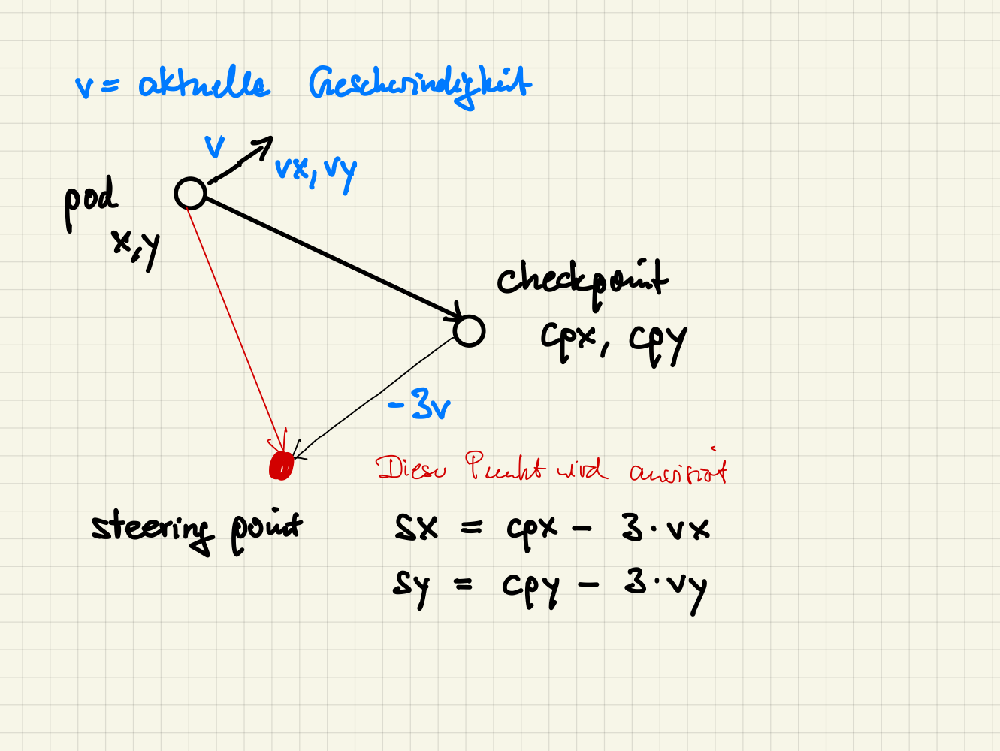

## Mad Pod Racing

[Mad Pod Racing](https://www.codingame.com/multiplayer/bot-programming/coders-strike-back)

Den Boost nutzen wir erst, wenn der Pod weit genug vom nächsten Checkpoint entfernt ist
und den nächsten Checkpoint einigermaßen im Visier hat.

Wir verwenden insgesamt nur eine print-Anweisung, damit wir nicht versehentlich zwei
prints in einer Runde absetzen. Damit erreichen wir Bronze.

```
boosted = False

while True:

    if not boosted and abs(next_checkpoint_angle) < 10 and next_checkpoint_dist > 5000:
        thrust = "BOOST"
        boosted = True
    elif abs(next_checkpoint_angle) > 90:
        thrust = 0
    else:
        thrust = 100

    print(str(next_checkpoint_x) + " " + str(next_checkpoint_y) +  " " + str(thrust))

```

#### Verbesserungen

Wenn der Pod schnell ist, kann es vorkommen, dass er die Kurve zum nächsten Checkpoint nicht schafft,
dann verliert er viel Zeit. Wir können das in den meisten Fällen verhindern, wenn wir nicht direkt den Mittelpunkt
des Checkpoints anpeilen, sondern einen Punkt daneben.

Für diese Korrektur benötigen wir die aktuelle Geschwindigkeit des Pods. Um die zu berechnen, merken wir uns die Position
aus dem letzen Durchgang.



```
boosted = False
px, py = 0, 0      # Position im letzten Durchgang
turn = 0           # Nr des Durchgangs

while True:
    turn +=1

    .....

    if turn == 1:        # Zu Beginn ist die vorherige Position die aktuelle
        px, py = x, y

    steering_x, steering_y = next_checkpoint_x, next_checkpoint_y

    if not boosted and abs(next_checkpoint_angle) < 20 and next_checkpoint_dist > 5000:
        thrust = "BOOST"
        boosted = True

    elif abs(next_checkpoint_angle) > 90:
        thrust = 0
    else:
        thrust = 100
        vx = x - px          # Geschwindigkeit berechnen
        vy = y - py
        steering_x = next_checkpoint_x - 3*vx
        steering_y = next_checkpoint_y - 3*vy

    px, py, = x, y       # wir merken uns die aktuelle Position für den nächsten Durchgang

    print(f'{steering_x} {steering_y} {thrust}')    # mit einem f-String ist die Ausgabe bequemer

```

#### In Gold

In Gold ist die Variable next_checkpoint_angle nicht mehr gegeben. Den Wert muss man sich selbst
berechnen. Die beiden folgenden Funktionen helfen dabei.

```
def getAngle(x, y, xt, yt):
    '''
    returns: der Blickwinkel wenn man von x,y nach xt, yt blickt, 0 <= result < 360
    '''
    tmp = math.degrees(math.atan2(yt-y, xt-x))
    return tmp if tmp >= 0 else 360+tmp

def diffAngle(x, y, angle, xt, yt):
    '''
    returns: den Winkel, um man sich in x, y drehen muss, um nach xt, yt zu blicken, wenn
    man momentan in die Richtung angle blickt, mit 0 <= angle < 360
    Es wird jeweils die kuerzere Drehrichtung gewählt.
    -180 < result <= +180
    '''
    a = getAngle(x,y,xt,yt)
    right = a - angle if angle <= a else 360 - angle + a
    left = angle -a if angle >= a else angle + 360 - a
    right = round(right)
    left = round(left)
    return right if right < left else -left

...

# cpx, cpy  - Koordinaten des nächsten checkpoints
next_checkpoint_angle = diffAngle(x,y,angle,cpx,cpy)


```
