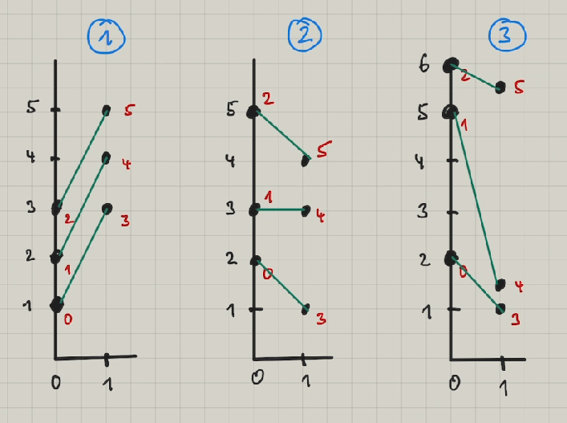

```python
from collections import namedtuple
import math, sys
```

## Spring Challenge 2022

#### 01

Copy Starter Code

#### 02

-   Funktion log einfügen
-   Konstanten WIDTH und HEIGHT für die Spielfläche
-   namedtuple Point und die basen als Point modellieren.
-   eine Funktion spiegle, die einen Punkt an der Mitte spiegelt
-   Variablen my_base und opp_base als Punkte
-   Funktion distance für die Entfernung zwischen zwei Punkten
-   Eine Variable debug, die die log-Ausgaben steuert.
-   Eine Variable turn, für die Nummer des Durchgangs

Variablennamen

-   p, p1, p2, ... für Punkte, pp für eine Liste mit Punkten
-   e, e1, e2, ... für Entities, ee für eine Liste mit Entities

```python
def log(*x):
    print(*x, file=sys.stderr)

def spiegle(p):
    return Point(WIDTH-p.x, HEIGHT-p.y)

def distance(p1, p2):
    return math.hypot(p2.x-p1.x, p2.y-p1.y)

WIDTH, HEIGHT = 17630,  9000

Point = namedtuple('Point', 'x y')

my_base = Point(base_x, base_y)
opp_base = Point(my_base)

debug = True
turn = 0

# game loop
while True:
    turn +=1
    ....
```

Test

```python
if debug: log(f'turn: {turn}')

for i in range(heroes_per_player):
    h = my_heroes[i]

    if debug:
        log(f'Pos {h.id}: {h.x} {h.y}')
```

Beobachtung: Die Koordinaten, die z.B. für turn 8 mit log ausgeben werden sind die, die man bei turn 7 auf dem Bild sieht.
log spiegelt die Situation zu Beginn des turns wieder, das Bild die Situation am Ende des turns.

#### 03

Die heros sollen sich zu Beginn in einen Anfangsposition begeben. Wir wählen geeignete startpoints. Falls wir nicht
links spielen, müssen wir die startpoints spiegeln

```python
links = True if my_base == Point(0,0) else False
startpoints = [Point(5500,1500),Point(4500,4500),Point(1500,5500)]
if not links:
    startpoints = [spiegle(p) for p in startpoints]
```

Test durch Spielen gegen sich selbst

#### 04

Sortieren der Monster nach threatlevels. Kontrolle durch ausgeben der threatlevels.

```python
def threatlevel(m):
    wd = 1000    # Gewicht für die Distanz
    dist = 1/distance(m,my_base)

    threat = wd * dist
    return threat


monsters = sorted(monsters,key = threatlevel, reverse = True)
if debug:
    for m in monsters:
        log(f'{m.id}:dist={distance(m,my_base):.0f} threat={threatlevel(m):.4f}')
```

#### Zwischenstand 01 - 04

Mit dieser Version erreichen wir Bronze

```python
import sys
import math
from collections import namedtuple

def log(*x):
    print(*x, file=sys.stderr)

def spiegle(p):
    return Point(WIDTH-p.x, HEIGHT-p.y)

def distance(p1, p2):
    return math.hypot(p2.x-p1.x, p2.y-p1.y)


def threatlevel(m):
    wd = 1000
    dist = 1/distance(m,my_base)

    threat = wd * dist
    return threat

Entity = namedtuple('Entity', [
    'id', 'type', 'x', 'y', 'shield_life', 'is_controlled', 'health', 'vx', 'vy', 'near_base', 'threat_for'
])
Point = namedtuple('Point', 'x y')

TYPE_MONSTER = 0
TYPE_MY_HERO = 1
TYPE_OP_HERO = 2

WIDTH, HEIGHT = 17630,  9000

base_x, base_y = [int(i) for i in input().split()]
heroes_per_player = int(input())

my_base = Point(base_x, base_y)
opp_base, opp_base_y = spiegle(my_base)

links = True if my_base == Point(0,0) else False
startpoints = [Point(5500,1500),Point(4500,4500),Point(1500,5500)]
if not links:
    startpoints = [spiegle(p) for p in startpoints]

debug = True
turn = 0

# game loop
while True:
    turn+=1

    my_health, my_mana = [int(j) for j in input().split()]
    enemy_health, enemy_mana = [int(j) for j in input().split()]
    entity_count = int(input())  # Amount of heros and monsters you can see

    monsters = []
    my_heroes = []
    opp_heroes = []
    for i in range(entity_count):
        _id, _type, x, y, shield_life, is_controlled, health, vx, vy, near_base, threat_for = [int(j) for j in input().split()]
        entity = Entity(
            _id,            # _id: Unique identifier
            _type,          # _type: 0=monster, 1=your hero, 2=opponent hero
            x, y,           # x,y: Position of this entity
            shield_life,    # shield_life: Ignore for this league; Count down until shield spell fades
            is_controlled,  # is_controlled: Ignore for this league; Equals 1 when this entity is under a control spell
            health,         # health: Remaining health of this monster
            vx, vy,         # vx,vy: Trajectory of this monster
            near_base,      # near_base: 0=monster with no target yet, 1=monster targeting a base
            threat_for      # threat_for: Given this monster's trajectory, is it a threat to 1=your base, 2=your opponent's base, 0=neither
        )

        if _type == TYPE_MONSTER:
            monsters.append(entity)
        elif _type == TYPE_MY_HERO:
            my_heroes.append(entity)
        elif _type == TYPE_OP_HERO:
            opp_heroes.append(entity)

    if debug: log(f'turn: {turn}')

    monsters = sorted(monsters,key = threatlevel, reverse = True)
    if debug:
        for m in monsters:
            log(f'{m.id}:dist={distance(m,my_base):.0f} threat={threatlevel(m):.4f}')


    for i in range(heroes_per_player):
        h = my_heroes[i]

        if debug:
            log(f'Pos {h.id}: {h.x} {h.y}')

        target = None
        if monsters:

            target = monsters[i % len(monsters)]

        if target:
            print(f'MOVE {target.x} {target.y}')
        else:
            print(f'MOVE {startpoints[i].x} {startpoints[i].y}')
```

## Teil 2

Die Zuteilung der Monster zu den heros wird verbessert.

Wir haben 3 heros auf 0-n Monster zu verteilen. Wir suchen uns die drei gefährlichsten Monster und wählen die Aufteilung so, dass der Gesamtweg aller 3 heros zu den zugeteilten Monstern am kleinsten ist.

Die optimale Zuteilung ist ein _Matching_-Problem. Die Algorithmen zur Lösung von Matching-Problemen sind nicht einfach. Da wir hier nur höchstens 3 auf 3 Einheiten matchen müssen, probieren wir alle Zuteilungen aus und suchen uns die beste heraus.

Wir entwickeln den Ablauf außerhalb der Codingame-IDE, damit wir das Ergebnis einfacher testen können.

```python
from collections import namedtuple
import itertools as it
import math
inf = float('inf')
Point = namedtuple('Point', 'id x y')

def distance(p1, p2):
    '''  returns: Distanz zwischen 2 Punkten '''
    return math.hypot(p2.x-p1.x,p2.y-p1.y)
```

Wir erzeugen uns Testdaten und notieren uns, welche Ergebnisse wir dafür wünschen



```python
def daten1():
    h1, h2, h3 = Point(0,0,1), Point(1,0,2), Point(2,0,3)
    m1, m2, m3 = Point(3,1,3), Point(4,1,4), Point(5,1,5)
    hh = [h1, h2, h3]
    mm = [m1, m2, m3]
    return hh, mm

def daten2():
    h1, h2, h3 = Point(0,0,2), Point(1,0,3), Point(2,0,5)
    m1, m2, m3 = Point(3,1,1), Point(4,1,3), Point(5,1,4)
    hh = [h1, h2, h3]
    mm = [m1, m2, m3]
    return hh, mm

def daten3():
    h1, h2, h3 = Point(0,0,2), Point(1,0,5), Point(2,0,6)
    m1, m2, m3 = Point(3,1,1), Point(4,1,1.5), Point(5,1,5.5)
    hh = [h1, h2, h3]
    mm = [m1, m2, m3]
    return hh, mm


```

```python
def assignments(hids,mids):
    ''' hids: Liste mit Zahlen (heroids), mids: Liste mit Zahlen (mosterids)
    returns Liste mit möglichen Zuordnungen

    Beispiel:
    hids = [1,2] ,  mids = [3,4,5]
    returns:
    [[(1, 3), (2, 4)], [(1, 3), (2, 5)], [(1, 4), (2, 3)], [(1, 4), (2, 5)], [(1, 5), (2, 3)], [(1, 5), (2, 4)]]
    '''

    result = []
    L = min(len(hids),len(mids))
    for tup in it.permutations(hids,L):
        for tup2 in it.permutations(mids,L):
            a = sorted((zip(tup,tup2)))
            if a not in result:
                result.append(a)
    return result

def kosten(assignment):
    kost = 0
    for i,j in assignment:
        kost += distance(hdict[i], mdict[j])
    return kost

def getAssignment(hh,mm):
    best = None
    bestVal  = inf
    hids = [h.id for h in hh]
    mids = [m.id for m in mm]
    for a in assignments(hids,mids):
        if kosten(a) < bestVal:
            bestVal = kosten(a)
            best = a
    adict = dict()
    if best:
        for (i,j) in best:
            adict[i] = j
    return adict
```

```python
hh,mm = daten3()
hdict = {h.id : h for h in hh}
mdict = {m.id : m for m in mm}

getAssignment(hh,mm)
```

    {0: 3, 1: 4, 2: 5}

Mit der besseren Zuteilung der Heros auf die Monster steigen wir in der Bronze_League auf, ohne Silver zu erreichen.
Bisher setzen wir keine Spells ein, obwohl wir viel Mana erreichen.
Jetzt setzen zusätzlich Wind ein und vertreiben jedes Monster das unserer Base näher als WIND_DEFEND_DIST = 4800 kommt. Das frühzeitige
vertreiben hat den Effekt, das wir weiterhin viel Mana außerhalb unserer Base erhalten können (wild mana) was für eine
rein defensive Strategie wichtig ist. Wir definieren noch einige Funktionen zur besseren Lesbarkeit und erreichen wir bereite damit einen guten Platz in der Silver-League.

```python
import sys
import math
import itertools as it
from collections import namedtuple
inf = float('inf')

def log(*x):
    print(*x, file=sys.stderr)

def spiegle(p):
    return Point(WIDTH-p.x, HEIGHT-p.y)

def distance(p1, p2):
    return math.hypot(p2.x-p1.x, p2.y-p1.y)

def threatlevel(m):
    wd = 1000
    dist = 1/distance(m,my_base)

    threat = wd * dist
    return threat

def assignments(hids,mids):
    ''' hids: Liste mit Zahlen (heroids), mids: Liste mit Zahlen (mosterids)
    returns Liste mit möglichen Zuordnungen

    Beispiel:
    hids = [1,2] ,  mids = [3,4,5]
    returns:
    [[(1, 3), (2, 4)], [(1, 3), (2, 5)], [(1, 4), (2, 3)], [(1, 4), (2, 5)], [(1, 5), (2, 3)], [(1, 5), (2, 4)]]
    '''

    result = []
    L = min(len(hids),len(mids))
    for tup in it.permutations(hids,L):
        for tup2 in it.permutations(mids,L):
            a = sorted((zip(tup,tup2)))
            if a not in result:
                result.append(a)
    return result

def kosten(assignment):
    kost = 0
    for i,j in assignment:
        kost += distance(hdict[i], mdict[j])
    return kost

def getAssignment(hh,mm):
    best = None
    bestVal  = inf
    hids = [h.id for h in hh]
    mids = [m.id for m in mm]
    for a in assignments(hids,mids):
        if kosten(a) < bestVal:
            bestVal = kosten(a)
            best = a
    adict = dict()
    if best:
        for (i,j) in best:
            adict[i] = j
    return adict

def unshielded(m):
    return m.shield_life == 0

def inWindRange(e1, e2):
    return distance(e1,e2) < WIND_RANGE

Entity = namedtuple('Entity', [
    'id', 'type', 'x', 'y', 'shield_life', 'is_controlled', 'health', 'vx', 'vy', 'near_base', 'threat_for'
])
Point = namedtuple('Point', 'x y')

TYPE_MONSTER = 0
TYPE_MY_HERO = 1
TYPE_OP_HERO = 2

WIDTH, HEIGHT = 17630,  9000

WIND_RANGE = 1280
WIND_DEFEND_DIST = 4800
MAX_ASSIGN_DIST = 10000

base_x, base_y = [int(i) for i in input().split()]
heroes_per_player = int(input())

my_base = Point(base_x, base_y)
opp_base = spiegle(my_base)

links = True if my_base == Point(0,0) else False
startpoints = [Point(5500,1500),Point(4500,4500),Point(1500,5500)]
if not links:
    startpoints = [spiegle(p) for p in startpoints]

debug = True
turn = 0

# game loop
while True:
    turn+=1

    my_health, my_mana = [int(j) for j in input().split()]
    enemy_health, enemy_mana = [int(j) for j in input().split()]
    entity_count = int(input())  # Amount of heros and monsters you can see

    monsters = []
    my_heroes = []
    opp_heroes = []
    for i in range(entity_count):
        _id, _type, x, y, shield_life, is_controlled, health, vx, vy, near_base, threat_for = [int(j) for j in input().split()]
        entity = Entity(
            _id,            # _id: Unique identifier
            _type,          # _type: 0=monster, 1=your hero, 2=opponent hero
            x, y,           # x,y: Position of this entity
            shield_life,    # shield_life: Ignore for this league; Count down until shield spell fades
            is_controlled,  # is_controlled: Ignore for this league; Equals 1 when this entity is under a control spell
            health,         # health: Remaining health of this monster
            vx, vy,         # vx,vy: Trajectory of this monster
            near_base,      # near_base: 0=monster with no target yet, 1=monster targeting a base
            threat_for      # threat_for: Given this monster's trajectory, is it a threat to 1=your base, 2=your opponent's base, 0=neither
        )

        if _type == TYPE_MONSTER:
            monsters.append(entity)
        elif _type == TYPE_MY_HERO:
            my_heroes.append(entity)
        elif _type == TYPE_OP_HERO:
            opp_heroes.append(entity)

    if debug: log(f'turn: {turn}')

    monsters = sorted(monsters,key = threatlevel, reverse = True)

    hdict = {h.id : h for h in my_heroes}
    mdict = {m.id : m for m in monsters}

    hh = [h for h in my_heroes]
    mm = [m for m in monsters if distance(m,my_base)< MAX_ASSIGN_DIST]

    if debug:
        log('Die drei gefährlichsten Monster: ')
        for m in mm:
            log(f'{m.id}: {m.x} {m.y} lvl={threatlevel(m):.4f}')


    assign = getAssignment(hh,mm[:3])
    if debug:
       log('Assignments',assign)


    for i in range(heroes_per_player):
        h = my_heroes[i]


        if h.id in assign:
            m = mdict[assign[h.id]]

            if inWindRange(h,m) and unshielded(m) and distance(my_base,m) < WIND_DEFEND_DIST:
                print(f'SPELL WIND {opp_base.x} {opp_base.x}')
            else:

                print(f'MOVE {m.x} {m.y}')

        else:
            print(f'MOVE {startpoints[i].x} {startpoints[i].y}')
```

## Teil 3

Wir definieren einen Attacker opp als einen gegnerischen Helden der weniger als OPP_ATTACKER_DIST = 9000
von unserer Basis entfernt ist.
Wenn ein Hero bei seinem Assignment auf den opp trifft, vertreibt er in mit WIND falls das geht oder mit CONTROL.
Damit erreichen wir einen mittleren Platz in der Gold-League.

```python
import sys
import math
import itertools as it
from collections import namedtuple
inf = float('inf')

def log(*x):
    print(*x, file=sys.stderr)

def spiegle(p):
    return Point(WIDTH-p.x, HEIGHT-p.y)

def distance(p1, p2):
    return math.hypot(p2.x-p1.x, p2.y-p1.y)

def threatlevel(m):
    wd = 1000
    dist = 1/distance(m,my_base)

    threat = wd * dist
    return threat

def assignments(hids,mids):
    ''' hids: Liste mit Zahlen (heroids), mids: Liste mit Zahlen (mosterids)
    returns Liste mit möglichen Zuordnungen

    Beispiel:
    hids = [1,2] ,  mids = [3,4,5]
    returns:
    [[(1, 3), (2, 4)], [(1, 3), (2, 5)], [(1, 4), (2, 3)], [(1, 4), (2, 5)], [(1, 5), (2, 3)], [(1, 5), (2, 4)]]
    '''

    result = []
    L = min(len(hids),len(mids))
    for tup in it.permutations(hids,L):
        for tup2 in it.permutations(mids,L):
            a = sorted((zip(tup,tup2)))
            if a not in result:
                result.append(a)
    return result

def kosten(assignment):
    kost = 0
    for i,j in assignment:
        kost += distance(hdict[i], mdict[j])
    return kost

def getAssignment(hh,mm):
    best = None
    bestVal  = inf
    hids = [h.id for h in hh]
    mids = [m.id for m in mm]
    for a in assignments(hids,mids):
        if kosten(a) < bestVal:
            bestVal = kosten(a)
            best = a
    adict = dict()
    if best:
        for (i,j) in best:
            adict[i] = j
    return adict

def unshielded(m):
    return m.shield_life == 0

def inWindRange(e1, e2):
    return distance(e1,e2) < WIND_RANGE

def inControlRange(e1, e2):
    return distance(e1,e2) < CONTROL_RANGE

Entity = namedtuple('Entity', [
    'id', 'type', 'x', 'y', 'shield_life', 'is_controlled', 'health', 'vx', 'vy', 'near_base', 'threat_for'
])
Point = namedtuple('Point', 'x y')

TYPE_MONSTER = 0
TYPE_MY_HERO = 1
TYPE_OP_HERO = 2

WIDTH, HEIGHT = 17630,  9000

WIND_RANGE = 1280
CONTROL_RANGE = 2200
WIND_DEFEND_DIST = 4800
MAX_ASSIGN_DIST = 10000
OPP_ATTACKER_DIST = 9000

base_x, base_y = [int(i) for i in input().split()]
heroes_per_player = int(input())

my_base = Point(base_x, base_y)
opp_base = spiegle(my_base)

links = True if my_base == Point(0,0) else False
startpoints = [Point(5500,1500),Point(4500,4500),Point(1500,5500)]
if not links:
    startpoints = [spiegle(p) for p in startpoints]

debug = True
turn = 0

# game loop
while True:
    turn+=1

    my_health, my_mana = [int(j) for j in input().split()]
    enemy_health, enemy_mana = [int(j) for j in input().split()]
    entity_count = int(input())  # Amount of heros and monsters you can see

    monsters = []
    my_heroes = []
    opp_heroes = []
    for i in range(entity_count):
        _id, _type, x, y, shield_life, is_controlled, health, vx, vy, near_base, threat_for = [int(j) for j in input().split()]
        entity = Entity(
            _id,            # _id: Unique identifier
            _type,          # _type: 0=monster, 1=your hero, 2=opponent hero
            x, y,           # x,y: Position of this entity
            shield_life,    # shield_life: Ignore for this league; Count down until shield spell fades
            is_controlled,  # is_controlled: Ignore for this league; Equals 1 when this entity is under a control spell
            health,         # health: Remaining health of this monster
            vx, vy,         # vx,vy: Trajectory of this monster
            near_base,      # near_base: 0=monster with no target yet, 1=monster targeting a base
            threat_for      # threat_for: Given this monster's trajectory, is it a threat to 1=your base, 2=your opponent's base, 0=neither
        )

        if _type == TYPE_MONSTER:
            monsters.append(entity)
        elif _type == TYPE_MY_HERO:
            my_heroes.append(entity)
        elif _type == TYPE_OP_HERO:
            opp_heroes.append(entity)

    if debug: log(f'turn: {turn}')

    monsters = sorted(monsters,key = threatlevel, reverse = True)

    hdict = {h.id : h for h in my_heroes}
    mdict = {m.id : m for m in monsters}

    hh = [h for h in my_heroes]
    mm = [m for m in monsters if distance(m,my_base)< MAX_ASSIGN_DIST]

    if debug:
        log('Die drei gefährlichsten Monster: ')
        for m in mm:
            log(f'{m.id}: {m.x} {m.y} lvl={threatlevel(m):.4f}')

    opp = None
    for h in opp_heroes:
        if distance(h,my_base) < OPP_ATTACKER_DIST:
            opp = h


    assign = getAssignment(hh,mm[:3])
    if debug:
       log('Assignments',assign)


    for i in range(heroes_per_player):
        h = my_heroes[i]

        if h.id in assign:
            m = mdict[assign[h.id]]

            if opp and inWindRange(h,opp) and unshielded(opp) and my_mana > 100:
                print(f'SPELL WIND {opp_base.x} {opp_base.y}')

            elif opp and inControlRange(h,opp) and unshielded(opp) and my_mana > 100:
                print(f'SPELL CONTROL {opp.id} {opp_base.x} {opp_base.y}')

            elif inWindRange(h,m) and unshielded(m) and distance(my_base,m) < WIND_DEFEND_DIST and my_mana>=10:
                print(f'SPELL WIND {opp_base.x} {opp_base.y}')
            else:
                print(f'MOVE {m.x} {m.y}')

        else:
            print(f'MOVE {startpoints[i].x} {startpoints[i].y}')
```

## Teil 4

Zum Aufstieg in die Legend-League reicht eine rein defensive Strategie vermutlich nicht. Wir müssen mindestens
einen Attacker definieren, der versucht, Monster in die gegnerische Basis zur pushen.
Der Attacker soll in der Nähe der Gegnerischen Basis lauern. Dafür definieren wir die Funktion getPositions, die wir auch für die Berechnung der Startposition der beiden Verteidiger verwenden


```python
Point = namedtuple('Point', 'x y')
def getPositions(dist, anzahl):
    tmp = []
    diff = 90/(anzahl)
    w = diff/2
    for k in range(anzahl):
        x =  int(dist*math.cos(math.radians(w)))
        y =  int(dist*math.sin(math.radians(w)))
        tmp.append(Point(x,y))
        w += diff
    return tmp
```

```python
getPositions(5500,2)
```

    [Point(x=5081, y=2104), Point(x=2104, y=5081)]

Den ersten unserer Heroes ernennen wir zum attacker, der gleich zu Beginn zum ersten roaming-Punkt bei der gegnerischen Basis geschickt wird und dort die Punkte nacheinander abklappert in der Hoffnung ein Monster zu erwischen, dass er in Richtung gegnerischer Basis mit Wind schicken kann. Wenn er Wind geschickt hat, geht er zweimal auf die Basis zu um gebenenfalls nochmal Wind zu schicken. Die Richtung des Windes berechnen wir nach folgender Skizze:


```python
import sys
import math
import itertools as it
from collections import namedtuple
inf = float('inf')

def log(*x):
    print(*x, file=sys.stderr)

def spiegle(p):
    return Point(WIDTH-p.x, HEIGHT-p.y)

def distance(p1, p2):
    return math.hypot(p2.x-p1.x, p2.y-p1.y)

def threatlevel(m):
    wd = 1000
    dist = 1/distance(m,my_base)

    threat = wd * dist
    return threat

def assignments(hids,mids):
    ''' hids: Liste mit Zahlen (heroids), mids: Liste mit Zahlen (mosterids)
    returns Liste mit möglichen Zuordnungen

    Beispiel:
    hids = [1,2] ,  mids = [3,4,5]
    returns:
    [[(1, 3), (2, 4)], [(1, 3), (2, 5)], [(1, 4), (2, 3)], [(1, 4), (2, 5)], [(1, 5), (2, 3)], [(1, 5), (2, 4)]]
    '''

    result = []
    L = min(len(hids),len(mids))
    for tup in it.permutations(hids,L):
        for tup2 in it.permutations(mids,L):
            a = sorted((zip(tup,tup2)))
            if a not in result:
                result.append(a)
    return result

def kosten(assignment):
    kost = 0
    for i,j in assignment:
        kost += distance(hdict[i], mdict[j])
    return kost

def getAssignment(hh,mm):
    best = None
    bestVal  = inf
    hids = [h.id for h in hh]
    mids = [m.id for m in mm]
    for a in assignments(hids,mids):
        if kosten(a) < bestVal:
            bestVal = kosten(a)
            best = a
    adict = dict()
    if best:
        for (i,j) in best:
            adict[i] = j
    return adict

def unshielded(m):
    return m.shield_life == 0

def inWindRange(e1, e2):
    return distance(e1,e2) < WIND_RANGE

def inControlRange(e1, e2):
    return distance(e1,e2) < CONTROL_RANGE

def getPositions(dist, anzahl):
    tmp = []
    diff = 90/anzahl
    w = diff/2
    for k in range(anzahl):
        x =  int(dist*math.cos(math.radians(w)))
        y =  int(dist*math.sin(math.radians(w)))
        tmp.append(Point(x,y))
        w += diff
    return tmp

Entity = namedtuple('Entity', [
    'id', 'type', 'x', 'y', 'shield_life', 'is_controlled', 'health', 'vx', 'vy', 'near_base', 'threat_for'
])
Point = namedtuple('Point', 'x y')

TYPE_MONSTER = 0
TYPE_MY_HERO = 1
TYPE_OP_HERO = 2

WIDTH, HEIGHT = 17630,  9000

WIND_RANGE = 1280
CONTROL_RANGE = 2200

WIND_DEFEND_DIST = 800
MAX_ASSIGN_DIST = 10000

base_x, base_y = [int(i) for i in input().split()]
heroes_per_player = int(input())

my_base = Point(base_x, base_y)
opp_base = spiegle(my_base)

links = True if my_base == Point(0,0) else False
startpoints = getPositions(5500,2)

# ----- werden in turn 1 gesetzt
attacker_id = None
defender_ids = []
startpointsDict = dict()   # defenderid -> startposition

roamingpoints = [spiegle(p) for p in getPositions(4500,5)]
roamingidx = 0

follow = False
follow2 = False

if not links:
    startpoints = [spiegle(p) for p in startpoints]
    roamingpoints = [spiegle(p) for p in roamingpoints]

turn = 0

# game loop
while True:
    turn+=1

    my_health, my_mana = [int(j) for j in input().split()]
    enemy_health, enemy_mana = [int(j) for j in input().split()]
    entity_count = int(input())  # Amount of heros and monsters you can see

    monsters = []
    my_heroes = []
    opp_heroes = []
    for i in range(entity_count):
        _id, _type, x, y, shield_life, is_controlled, health, vx, vy, near_base, threat_for = [int(j) for j in input().split()]
        entity = Entity(
            _id,            # _id: Unique identifier
            _type,          # _type: 0=monster, 1=your hero, 2=opponent hero
            x, y,           # x,y: Position of this entity
            shield_life,    # shield_life: Ignore for this league; Count down until shield spell fades
            is_controlled,  # is_controlled: Ignore for this league; Equals 1 when this entity is under a control spell
            health,         # health: Remaining health of this monster
            vx, vy,         # vx,vy: Trajectory of this monster
            near_base,      # near_base: 0=monster with no target yet, 1=monster targeting a base
            threat_for      # threat_for: Given this monster's trajectory, is it a threat to 1=your base, 2=your opponent's base, 0=neither
        )

        if _type == TYPE_MONSTER:
            monsters.append(entity)
        elif _type == TYPE_MY_HERO:
            my_heroes.append(entity)
        elif _type == TYPE_OP_HERO:
            opp_heroes.append(entity)

    # ---- im turn 1 werden attacker_id und defender_ids gesetzt
    if turn == 1:
        attacker_id = my_heroes[0].id
        defender_ids = [h.id for h in my_heroes if h.id != attacker_id]
        for i,v in enumerate(defender_ids):
            startpointsDict[v] = startpoints[i]

    monsters = sorted(monsters,key = threatlevel, reverse = True)

    hdict = {h.id : h for h in my_heroes}
    mdict = {m.id : m for m in monsters}

    hh = [h for h in my_heroes]
    mm = [m for m in monsters if distance(m,my_base)< MAX_ASSIGN_DIST]

    defender = [hdict[id] for id in defender_ids]
    assign = getAssignment(defender,mm[:2])

    for i in range(heroes_per_player):
        h = my_heroes[i]

        # ------- Defender
        if h.id in defender_ids:
            if h.id in assign:
                m = mdict[assign[h.id]]

                if inWindRange(h,m) and unshielded(m) and distance(my_base,m) < WIND_DEFEND_DIST and my_mana>=10:
                    print(f'SPELL WIND {opp_base.x} {opp_base.y}')
                else:
                    print(f'MOVE {m.x} {m.y}')

            else:
                print(f'MOVE {startpointsDict[h.id].x} {startpointsDict[h.id].y}')

        # ------- Attacker
        if h.id == attacker_id:
            mmo = [m for m in monsters if distance(m,opp_base)<9000]

            p = roamingpoints[roamingidx]
            if distance(h,p) < 400:
                roamingidx = (roamingidx + 1) % len(roamingpoints)

            done = False
            for m in monsters:

                if not done and distance(m,h) < WIND_RANGE and distance(m,opp_base) < 7200 and unshielded(m) and  my_mana>= 10:
                        print(f'SPELL WIND {h.x+opp_base.x-(m.x+m.vx)} {h.y+opp_base.y-(m.y+m.vy)}')
                        follow = True
                        done = True

            if not done and follow:
                    print(f'MOVE {opp_base.x} {opp_base.y}')
                    follow = False
                    follow2 = True
                    done = True

            if not done and follow2:
                    print(f'MOVE {opp_base.x} {opp_base.y}')
                    follow2 = False
                    done = True

            if not done:
                print(f'MOVE {p.x} {p.y}')
```

Mit diesem einfachen Angriff kommen wir schon unter die ersten 400 in der Gold-League. Um weiter aufzusteigen, müssen wir geschickter angreifen.
