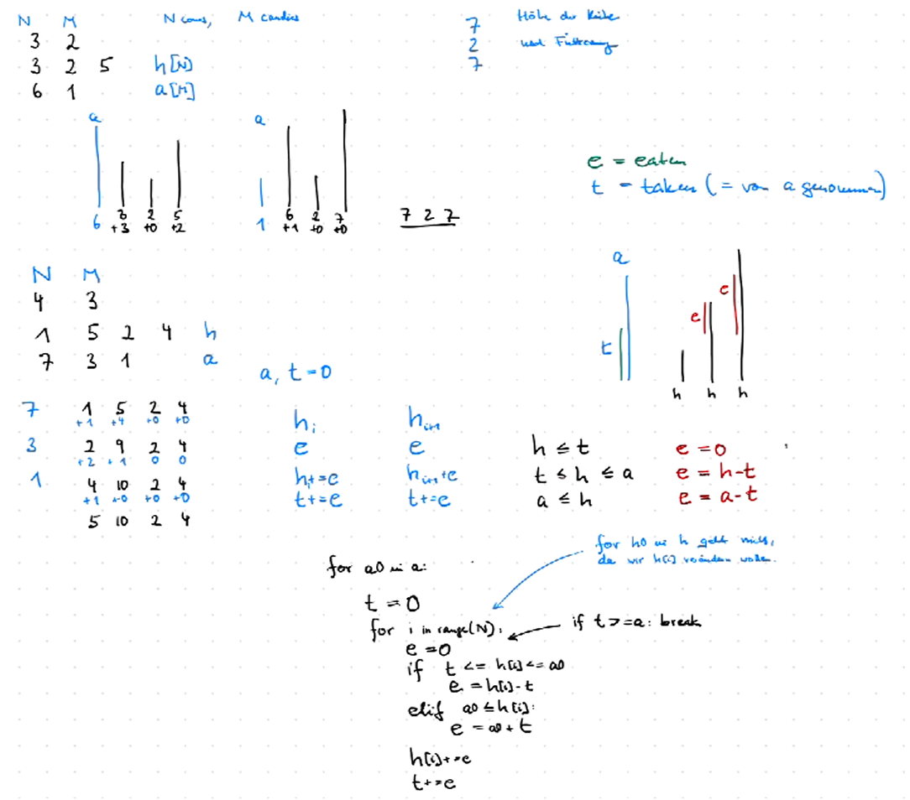

## USACO - Bronze Beispiele

### 2023 December 

#### Candy Cane

Wir verfolgen in der Variablen taken, wieviel schon von einem Candy gegessen wurde und in der Variablen eat, wieviel die jeweilige Kuh essen kann. Wenn taken größer gleich der Candylänge ist, beenden wir den Schleifendurchgang vorzeitig.

#### Contact Tracing
Es kommt nur auf die Länge der 1-Abschnitte an und ob sie am Rand sind oder nicht. Wir prüfen, ob wir für eine Tageszahl t alle
Abschnitte generieren können. Dann suchen wir die größte Tageszahl t, für die das geht und berechnen daraus die notwendigen Kühe.

#### Farmer John actually farms

Wenn die Pflanzen nach den t-Werten sortiert sind, muss man nur die jeweils nachfolgenden vergleichen, nicht mehr jede mit jeder.

----

### 2023 Open

#### FEB

Brute-force Ansatz für eine Teillösung und um schneller über verschiedene Eingaben das Muster zu finden.
Wir betrachten den String abschnittsweise. Die Abschnitte sind eingeschlossene F-Folgen oder solche am Rand. Es interessieren
uns nur die Längen der Abschnitte und ob sie durch gleichartige oder ungleichartige Kühe eingeschlossen sind oder Ränder sind.
Ja nach gerader/ungerader Länge gibt es unterschiedlich viele Möglichkeiten. Wenn keine Randfolgen vorhanden sind, sind auch die
kombinierten Längen immer im Zweiterabschnitt. Es reicht jeweils das Minimum und Maximum zu berechnen.

#### MooLanguae

Brute-force: Die erste Schleife geht über die mögliche Anzahl der intransitiven Verben. Gegeben diese Zahl,  probiert man absteigend die Anzahl der möglichen transitiven Verben aus. Die Anzahl der verwendeten transitiven und intransitiven Verben vermindert um die verfügbaren Konjunktionen bestimmt, wieviele Punkte vorhanden sein müssen. Hat man für eine Anzahl transitiver Verben einen besseren Satz gefunden, kann man aus der inneren Schleife raus. 

#### Rotate und Shift

Brute-force Ansatz für Teillösung und um das Muster zu erkennen. Das Erkennen des Musters vereinfacht sich, wenn man die Position der Tanzschritte konstant lässt und stattdessen die Kühe um eins nach links verschiebt. Shift-Funktionen für Listen sind nützlich.

----

### 2023 Februar

#### Hungry Cow

Wir updaten an jedem Liefertermin, wieviel schon gegessen wurde und was an Rest noch da ist.

#### Stamp Grid

brute-force: Wir stempeln an jeder Position und jeder Drehrichtung, sofern dadurch kein ungültiges Bild entsteht. Zum Schluss schauen wir,
ob das gewünschte Muster entstanden ist.

#### Mooloo

Wir berechnen für jeden watch-Tag, ob das bisherige Abo verlängert werden soll, oder ein neues abgeschlossen werden soll. 

----

### 2023 Januar 

#### Leaders

Es gibt zwei Möglichkeiten, Leader zu sein:
- (1) alle Elemente des eigenen breeds sind in der Liste
- (2) der andere Leader ist in der Liste

Beobachtungen:

- (2) kann nicht auf beide Leader zutreffen, da der spätere Index den früheren nicht in der Liste enthalten kann.
- (1) kann nur für den jeweils frühesten Index zutreffen.

#### Air Conditioning

Brute force: wir probieren alle Teilmengen von AirConditioner aus.

#### Moo Operations

Wenn ein O in der Mitte vorkommt geht das immer. Es müssen nur die überflüssigen Zeichen entfernt und die angrenzenden gegebenenfalls umgewandelt werden.

----

### 2022 December

#### Cow College

Complete Search: wir probieren alle sinnvollen Tuition-Werte aus

#### Feeding the Cows 

Wir platzieren den patch immer soweit rechts wie möglich, d.h. alle noch zu versorgenden Kühe bekommen einen patch bei i+k. Nur am Ende muss man aufpassen, dass man die patches richtig setzt. - [AlphaStar](https://www.youtube.com/watch?v=dWbMfohtudg)

#### Reverse Engineering

Wir müssen Spalten finden, bei denen ein Typ von Input genau einem Typ von Output zugeordnet ist. Dann können wir diese
Spalte und die entsprechenden Zeilen löschen. Das machen wir bis wir fertig sind. Genau betrachten: wann sind wir fertig?
Es empfiehlt sich, Funktionen zum Zeilen und Spaltenlöschen bereit zu halten.

----

### 2022 Februar

#### sleeping in class

Die Zahl k, die zum Schluss gleich sein soll, kennen wir nicht. Je kleiner sie ist, desto weniger Operationen waren nötig. Wir probieren alle ks aufsteigend aus, indem wir von links kommend aufaddieren.

#### photoshoot2

Wir gehen durch die oberen Zahlen und streichen die weg, die in derselben Reihenfolge wie unten stehen. Wenn wir unten fertig sind, zählen wir die übriggebliebenen. Die müssen verschoben werden.

#### blocks

Brute force: wir probieren alle Möglichkeiten aus

----

### 2022 Januar

#### herdle

Listen oder dicts anlegen, die zählen, wieviele Zeichen im guess und im korrekten grid vorkommen und wieviele richtig geraten wurden. Daraus kann man die Antwort berechnen. 

#### dice

Wir schreiben uns eine Funktion, die prüft, ob dice A einen anderen dice B schlägt. Wenn dies der Fall ist, suchen wir mit brute force einen dice C, der A schlägt, aber B nicht. v

#### draught

Wir versuchen zunächst ein brute force: wir nehmen an, das für alle gleiche Level sei k. Wir gehen sequentiell durch, und versuchen alle auf k zu setzen und ählen dabei, wieviel bags of corn wir verfüttern müssen. Falls es nicht geht, kommt das k nicht in Frage.

Wir gehen von den ersten beiden cows aus. Die cow an Index 1 muss mindestens auf den Level von 0 kommen. Das pflanzt sich weiter nach rechts fort. wenn wir dabei auf eine Zahl stoßen, die niedriger ist als die bisherige Konstante müssen wir die vorderen Zahlen auch reduzireen. Das geht aber nur, wenn das eine gerade Anzahl isten.
Mit dem brute force Algorithmus können wir uns durch zufällige Versuche weiter Beispiele generieren, von denen wir dann das Ergebnis wissen.

Ideen: Brute force (reicht nur für die Hälfte), vom ersten Element ausgehend die Folgen schrittweise nachverfolgen.

----

### 2021 December

#### Lonely Photo

Wir betrachten zunächst nur die G-Positionen. Wir bestimmen die Abstände a, b zu den nächstens Gs links und rechts. Daraus berechnen wir die Anzahl möglicher Bilder, die nur dieses eine G enthalten.

#### Air Cownditioning

Wir bilden zunächst die Liste der Differenzen zwischen tatsächlicher und gewünschter Temperatur. Dann fügen wir noch eine Null am Anfang hinzu (unsere Zieltemperatur). Von dieser Liste bilden wir die Differenzliste und beobachten die Wirkung eines Befehls auf diese Liste.

#### Walking Home
Für Anfangsrichtung R gilt:
Bei einem Wechsel müssen die obere und rechte Randbahn frei sein. Zwei Wechsel sind durch eine Zahl 1..N-1 gekennzeichnet

----

### 2021 Februar

#### Year of the Cow

Wir ordnen Bessie in einem dict die Zahl 0 zu. Jeder weitere Namen wird mit seiner Differenz zur Bessie-Position in dem dict abgespeichert.
(in Python passt die modulo-Berechnung für negative Zahlen dazu). Zum Schluss wird der Absolutwert von Elsie ausgegeben.

#### Comfortable Cows

Wir speichern in einem dictionary welche Zellen wieviele Nachbarn haben und machen bei jeder neuen Koordinate einen update.
(Eines der wenigen Beispiele wo derselbe Algorithmus mit Python bei den letzten beiden Fällen wg. Zeit scheitert, aber mit C++ durchgeht).

#### Clockwise Fence

Wir zählen für eine Rechtsdrehung +1 für eine Linksdrehung -1, wenn wir insgesamt positiv ankommen, sind wir clockwise gegangen.

----

### 2021 Januar

#### Uddered but not Herd

Wir gehen jedesmal das Wort durch und merken uns, welche Buchstaben des Wortes hintereinanderkommen.

#### Even More

Jedes Paar Gerade - Ungerade gibt 2 Gruppen. Dann bleiben nur noch Geraden oder nur noch Ungeraden übrig. Die geraden kann man nur zu einer Gruppe zusammenfassen, bei den Ungeraden fasst man Gruppen zu gg,g zusammen soweit es geht und betrachtet den Rest.

#### Just Stalling

Zu Stallgröße ermitteln wir, wieviele Kühe da rein gehen, dann beginnen wir mit der Anzahl der möglichen Kühe für den kleinsten Stall und berechnen weiter die Gesamtzahl.

----

### 2020 December

#### Do you know your ABCs?

Wir sortieren die Zahlen nach Größe, die größte ist die Summe von allen, die beiden ersten müssen zwei Ausgangszahlen sein.

#### Daisy Chains

Genau das machen.

#### Stuck in a Rut

Aufgaben genau durchlesen: Die Kühe können nur nach N oder E gehen. Wir berechnen die kritischen Punkte, dazu einfach alle möglichen Differenzen zwischen den x und y Koordinaten der verschiedenen Kühe bilden, die diffListe bilden und in diesen Schritten das Ganze verfolgen. Hier können sogar Klassen nützlich sein.

-----

### 2020 Februar

